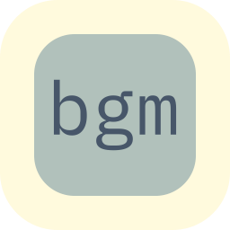
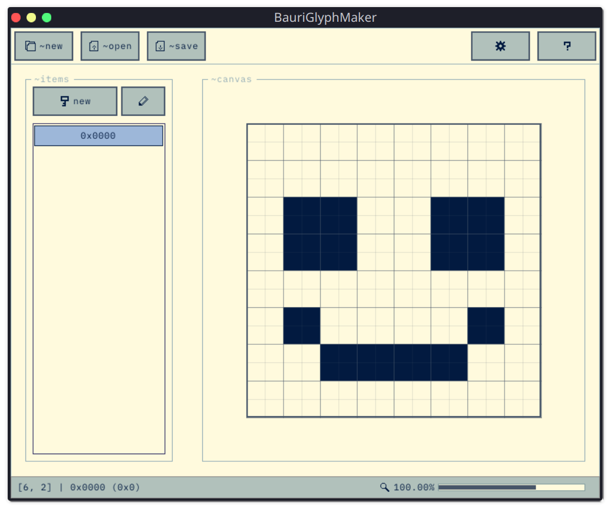

**BauriGlyphMaker**
*Small font and icon maker for small small applications like embedded systems.*

 

### Features
* Export as Python, Rust, C Code. `[TODO]`
* Export to multiple popular font formats `[TODO]`
* Clean UI
* Lightweight

### Screenshots

### License
BauriGlyphMaker is licensed under GNU General Public License v3.0
